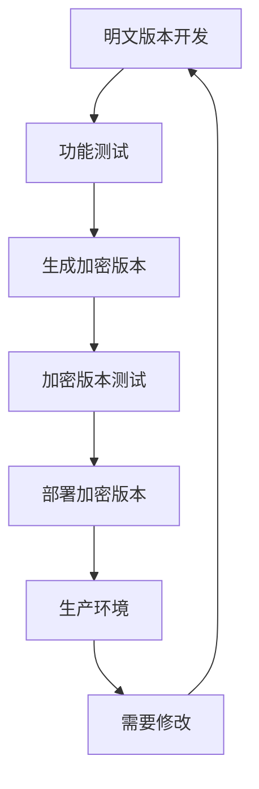

# 🔒 双版本部署指南 - 明文版 + 加密版

## 📋 版本概述

本项目提供两个版本，满足不同的使用场景：

### 📝 明文版本 (开发版)
- **用途**: 开发、学习、代码修改
- **特点**: 代码清晰可读，便于理解和调试
- **位置**: 当前目录
- **适用**: 本地开发、功能定制、代码学习

### 🔒 加密版本 (生产版)
- **用途**: 生产部署，防止源码检测
- **特点**: 代码混淆加密，防止逆向工程
- **位置**: `encrypted/` 目录
- **适用**: Cloudflare 部署、生产环境

## 🚀 快速开始

### 1. 使用版本管理器（推荐）

```bash
# 启动版本管理器
node version-manager.js
```

版本管理器提供以下功能：
- 📝 查看明文版本信息
- 🔒 生成/更新加密版本
- 🚀 部署明文版本
- 🛡️ 部署加密版本
- 🔍 比较两个版本
- 🧹 清理加密版本

### 2. 手动操作

#### 生成加密版本
```bash
node create-encrypted.js
```

#### 部署明文版本
```bash
# Workers
./deploy.sh

# Pages
./deploy-pages.sh
```

#### 部署加密版本
```bash
cd encrypted
./deploy.sh        # Workers
./deploy-pages.sh  # Pages
```

## 🛡️ 加密版本特性

### 🔧 混淆技术

1. **变量名混淆**
   - 函数名随机化
   - 变量名随机化
   - 保持功能完整性

2. **字符串加密**
   - 多层编码保护
   - XOR + Base64 双重加密
   - 动态解密函数

3. **数字混淆**
   - 数学表达式替换
   - 随机运算混淆
   - 保持数值准确性

4. **控制流混淆**
   - 添加无用条件判断
   - 垃圾代码插入
   - 执行路径复杂化

5. **反调试保护**
   - 环境检测
   - 调试器检测
   - 反爬虫机制

### 🛡️ 安全特性

- ✅ **防静态分析**: 代码结构混乱，难以理解
- ✅ **防动态调试**: 反调试代码，干扰调试器
- ✅ **防逆向工程**: 多层混淆，增加逆向难度
- ✅ **防源码泄露**: 关键逻辑加密保护
- ✅ **防自动化检测**: 环境检测，识别爬虫

## 📊 版本对比

| 特性 | 明文版本 | 加密版本 |
|------|----------|----------|
| **可读性** | ✅ 高 | ❌ 无 |
| **调试性** | ✅ 容易 | ❌ 困难 |
| **安全性** | ❌ 低 | ✅ 高 |
| **部署安全** | ⚠️ 有风险 | ✅ 安全 |
| **功能完整性** | ✅ 完整 | ✅ 完整 |
| **性能** | ✅ 原生 | ✅ 优化 |

## 🎯 使用建议

### 开发阶段
1. **使用明文版本**进行开发和测试
2. **修改功能**在明文版本中进行
3. **调试问题**使用明文版本

### 部署阶段
1. **生成加密版本**用于生产部署
2. **测试加密版本**确保功能正常
3. **部署加密版本**到 Cloudflare

### 维护阶段
1. **在明文版本中修改**代码
2. **重新生成加密版本**
3. **重新部署**更新的加密版本

## 🔄 工作流程



## 🛠️ 故障排除

### 加密版本生成失败
```bash
# 检查明文版本语法
node pre-deploy-check.js

# 重新生成
node create-encrypted.js
```

### 加密版本部署失败
```bash
# 检查加密版本
cd encrypted
node ../pre-deploy-check.js

# 重新部署
./deploy.sh
```

### 功能异常
1. **先测试明文版本**确认功能正常
2. **重新生成加密版本**
3. **对比两个版本**的行为差异

## 📁 目录结构

```
个人节点/
├── src/                        # 明文源码
│   ├── handlers/              # 请求处理器
│   ├── converters/            # 格式转换器
│   └── utils/                 # 工具函数
├── encrypted/                  # 加密版本 (自动生成)
│   ├── src/                   # 加密后源码
│   ├── deploy.sh              # 加密版本部署脚本
│   └── README.md              # 加密版本说明
├── create-encrypted.js        # 加密生成器
├── version-manager.js         # 版本管理器
├── 版本说明.md               # 版本说明
└── 双版本部署指南.md         # 本文件
```

## ⚠️ 重要提醒

### 明文版本
- ✅ 适合开发学习
- ✅ 代码清晰易懂
- ⚠️ 不建议生产部署
- ⚠️ 存在源码泄露风险

### 加密版本
- ✅ 适合生产部署
- ✅ 源码安全保护
- ✅ 防检测机制
- ⚠️ 不可直接修改
- ⚠️ 调试困难

## 🎉 总结

双版本系统为您提供：
- 🔧 **开发便利性**: 明文版本便于开发调试
- 🛡️ **部署安全性**: 加密版本保护源码安全
- 🔄 **灵活切换**: 版本管理器简化操作
- 📈 **最佳实践**: 开发和生产环境分离

立即开始使用双版本系统，享受安全高效的开发部署体验！🚀
